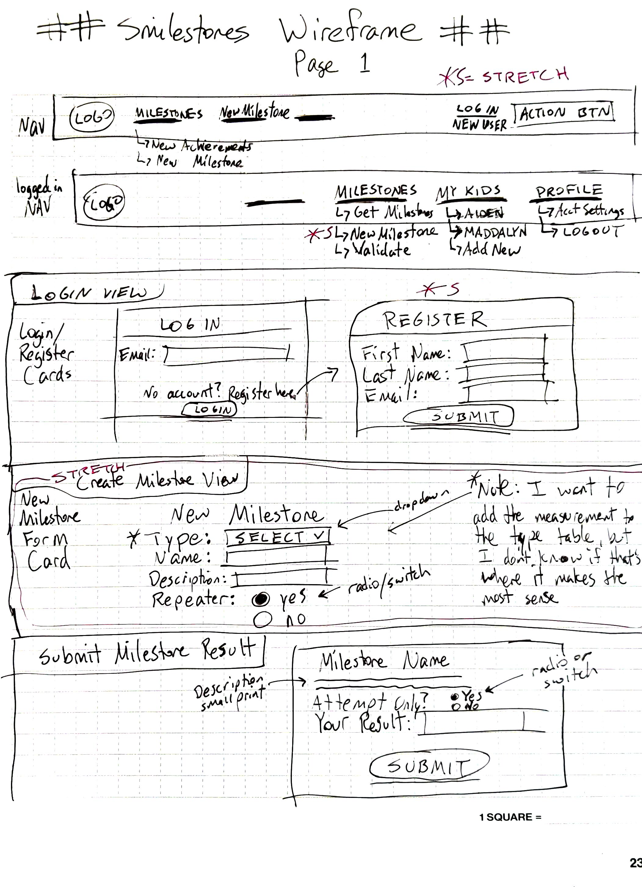
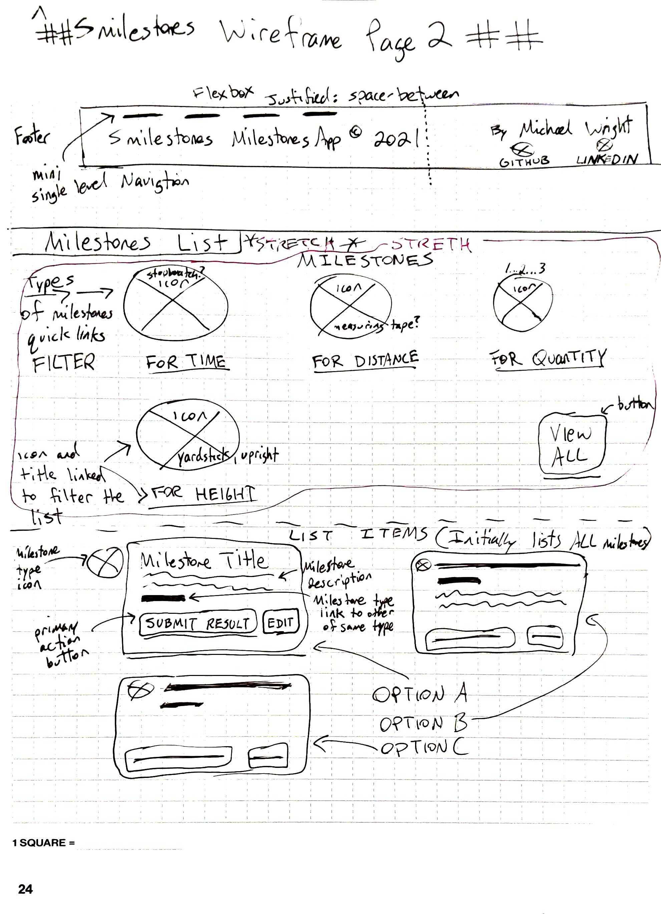

# Smilestones App
The Smilestones app lets a parent create milestones for their children to achieve.

## How It Works 
A parent creates and manages child's account. A parent can create and modify milestones, and a child can log in, choose a completed milestone, and submit their results.

## Smilestones Mockup/Wireframe

## Smilestone Entity Relationship Diagram (ERD)

