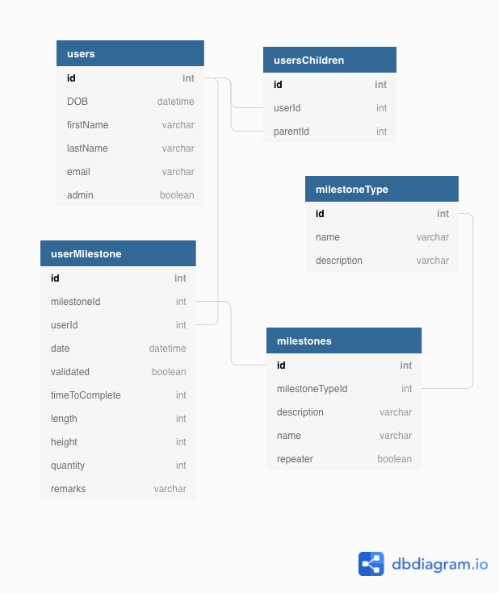

# Smilestones App
The Smilestones App lets a parent create milestones for their children to achieve.

## How It Works 
A parent creates and manages a child's account. A parent can create and modify milestones. Both children and parents can log in, choose a milestone, and submit results for a milestone.

## Smilestones Mockup/Wireframe

## Smilestone Entity Relationship Diagram (ERD)

